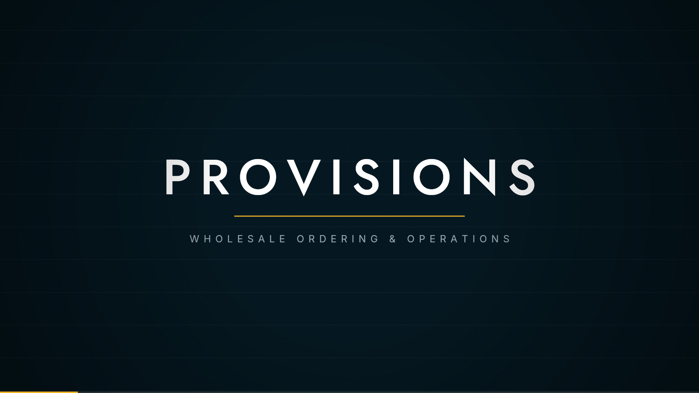
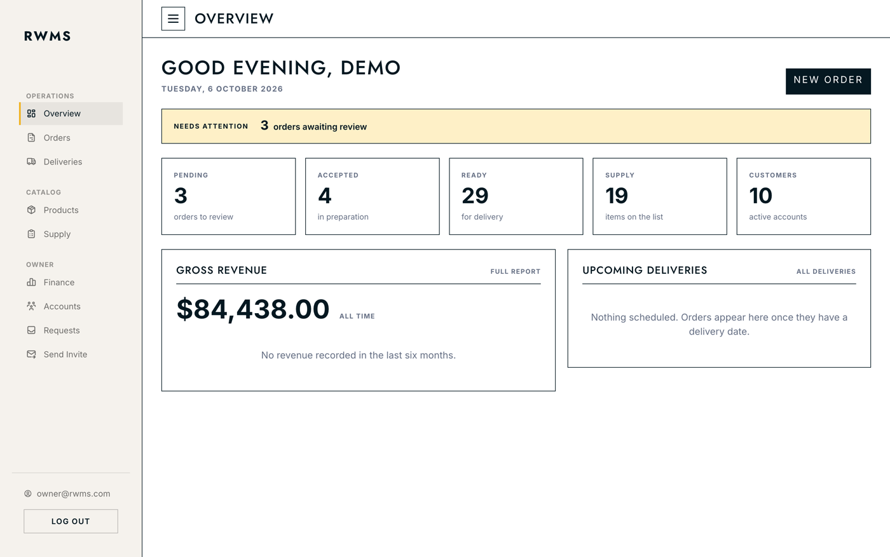
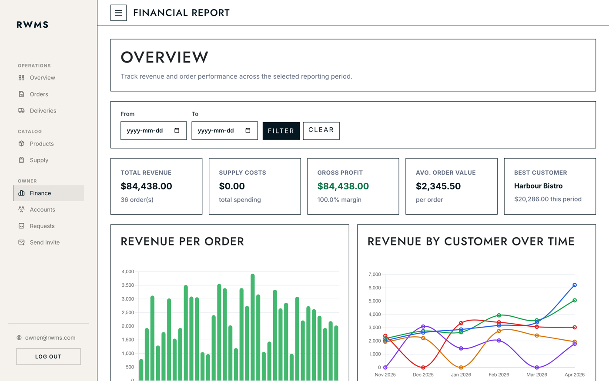
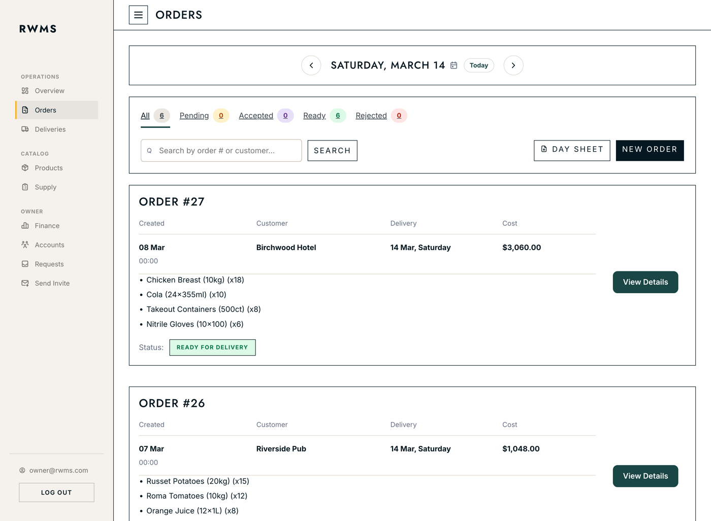
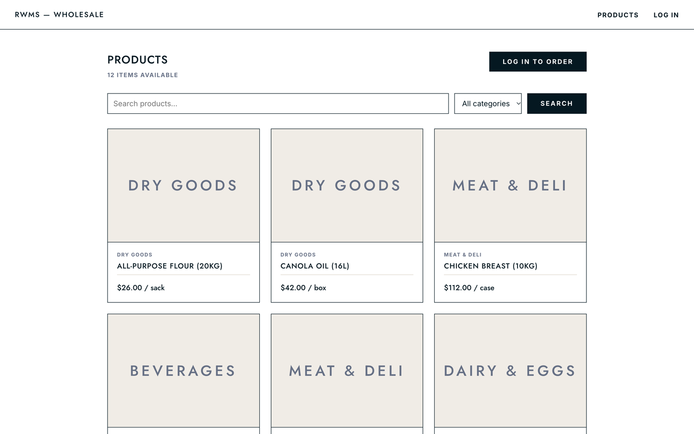

# Provisions

**A wholesale ordering and operations platform for foodservice distributors.**

Distributors still run on phone calls, text messages and spreadsheets. Provisions replaces that with
two connected surfaces: an **operations backend** for the distributor's own staff, and a **customer
portal** where venues place their own orders.

<p align="center">
  <a href="docs/showreel.mp4">
    
  </a>
  <br>
  <em><a href="docs/showreel.mp4">▶ Watch the 15-second showreel</a></em>
</p>

---

## What it does

### Operations backend — Owner and Manager

| | |
|---|---|
| **Overview** | Everything needing attention today: orders awaiting review, account requests, supply levels |
| **Orders** | Day-by-day order book with per-item accept/reject, status flow, and invoice PDFs |
| **Deliveries** | Build delivery runs from ready orders, assign a driver, print a day sheet |
| **Products** | Catalogue management with soft deletes, so historical orders keep their references |
| **Supply** | Internal purchasing list with a reusable catalogue and unit-cost tracking |
| **Finance** *(Owner only)* | Revenue, supply cost and margin over any date range, with per-customer trends |
| **Accounts** | User management, customer self-signup requests, and invitations |

### Customer portal — the venues

- Browse the catalogue, or a **personalised order guide** of the products assigned to them
- Place orders against a requested delivery date
- Track order status and history

---

## Screens

| Operations overview | Finance |
|---|---|
|  |  |

| Order book | Customer portal |
|---|---|
|  |  |

---

## Technology

| Layer | Choice |
|---|---|
| Runtime | .NET 9 / ASP.NET Core MVC |
| Data | EF Core 9, SQL Server |
| Auth | ASP.NET Core Identity, policy-based authorisation |
| PDF | QuestPDF — invoices, day sheets, order lists |
| Email | MailKit over SMTP |
| Charts | Chart.js |
| Styling | Hand-written CSS on ITCSS layers with shared design tokens — no framework |

---

## How it is put together

**Controllers stay thin.** They call a service, pass a ViewModel, and return a view. All business
rules — duplicate SKUs, stock checks, order totals, status transitions — live in the service layer
behind an interface, registered scoped alongside the `DbContext`.

**Domain models never reach a view.** Every screen is fed a purpose-built ViewModel, which is also
the only place validation attributes appear. Domain entities stay persistence-only.

**Authorisation is policy-based**, applied at the controller. `OwnerAccess` gates financial
reporting and user management; `ManagerAccess` covers day-to-day operations; customers only ever
reach the portal.

**Two themes, one token set.** The ops backend and the customer portal share `tokens.css` and the
component layer, then diverge in a theme file. Changing a brand colour changes both.

**Nothing is hard-deleted.** Products, orders and users carry `IsActive` / `DeletedAt`, because past
orders must keep referring to the thing that was actually ordered.

```
RWMS/
├── Controllers/            # thin — call a service, return a view
│   └── Portal/             # customer-facing
├── Models/
│   ├── Domain/             # EF entities, no UI concerns
│   └── ViewModels/         # per module, validation lives here
├── Services/
│   ├── Interfaces/         # contract first
│   └── Implementations/    # all business logic
├── Data/                   # DbContext + migrations
├── Views/                  # Razor, one folder per module
└── wwwroot/css/            # tokens → elements → components → pages → themes
```

---

## Running it locally

Prerequisites: .NET 9 SDK, and SQL Server (Docker is easiest on macOS).

```bash
# SQL Server in Docker
docker run -e 'ACCEPT_EULA=Y' -e 'MSSQL_SA_PASSWORD=<your-password>' \
           -p 1433:1433 --name provisions-sql -d mcr.microsoft.com/mssql/server:2022-latest

git clone https://github.com/RenanGutierrezz/provisions.git
cd provisions
```

Create `RWMS/appsettings.Development.json` (gitignored) with your connection string and SMTP
settings, then:

```bash
dotnet ef database update --project RWMS
dotnet run --project RWMS
```

The app seeds demo data in Development — a full catalogue, eight venues, and a year of orders.
It listens on <http://localhost:5011>.

| Demo account | Password | Sees |
|---|---|---|
| `owner@rwms.com` | `Owner@2024` | Everything, including Finance |
| `manager@rwms.com` | `Manager@2024` | Operations, no financial reporting |
| `orders@harbourbistro.ca` | `Client@2024` | Customer portal only |

---

## Origins

This began as a team project at George Brown College and was rebuilt from scratch afterwards as a
commercial system — new architecture, new data model, new design system. The original academic
prototype was built with **Andrea Salswach Lopez**.

Built by **Renan Gutierrez**.
